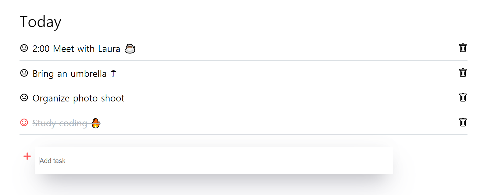

# 결과물

[바로가기](https://jungsikjeong.github.io/React-ToDoList)

## 이슈

- 글을 추가하면 바로 화면에 표시가안됨. 한번 더 입력해야 앞전에 입력했던게 화면에 표시됨 [o]

- 할 일을 완료했을때 체크하는 기능 또한 마찬가지. 한번 더 클릭해야 화면에 표시됨

## stack

- react

- styled-components

---

## 구조

전체 할일 리스트 화면을보여주는 컴포넌트 [App.js]

할일 추가하는 컴포넌트 [todoInsert.js]

---

## 기능

할일을 다 끝냈을때의 이모티콘변화 (컬러,표정) [o]

할일 추가 [o]

할일 지우기 [o]

---
